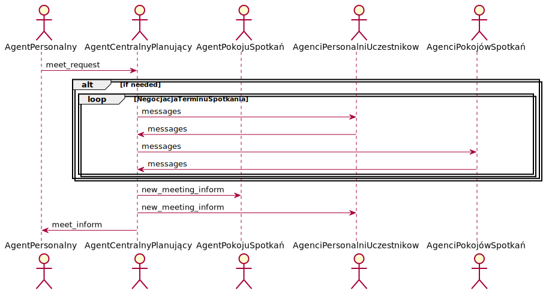
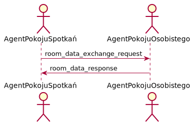
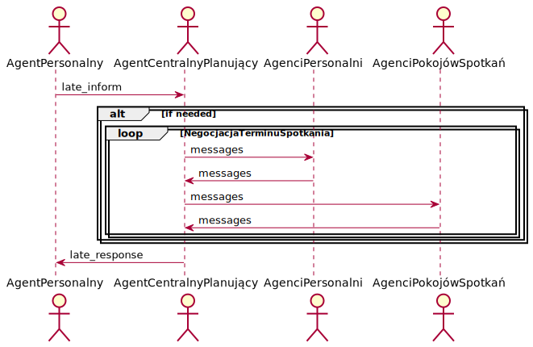
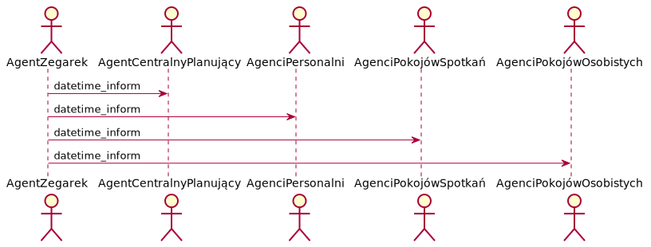
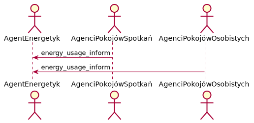
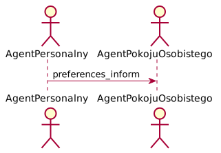
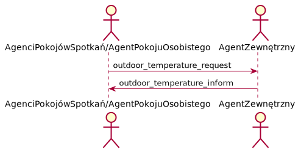
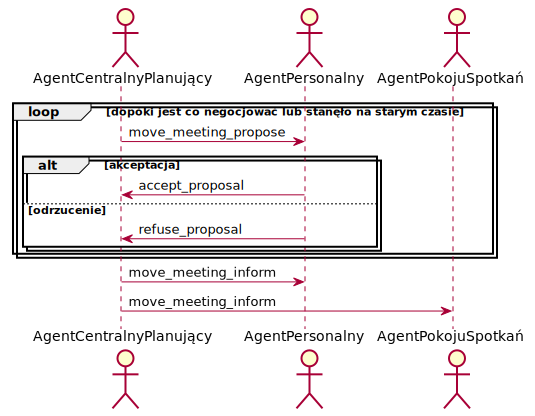

## Struktura systemu agentowego:
  - kalendarz centralny - będzie jednocześnie centralnym agentem podejmującym wszelkie decyzje
  #### Pozostali agenci koomunikujący się z centralnym:
  - klimatyzatory
  - źródła energii
  - ludzie
  - termometry w pomieszczeniach i na zewnątrz
  - prognoza pogody (np. agent pobierający temperaturę w danym dniu o danej godzinie z publicznego api)
  - informacje o korkach na drogach (j.w.)
## Opis części fizycznej projektu (termodynamika):
  - obliczanie potrzebnej energii klimatyzatora w oparciu o uproszczony bilans cieplny   
  - zakładamy, że temperatura w całym pokoju jest taka sama
  - na temperaturę w pokoju składają się:
    + wymiana ciepła przez każdą ze ścian pokoju (zarówno z innymi pokojami - ściany boczne oraz sufit i podłoga, jak i otoczeniem zewnętrznym)
    + ciepło (w sensie fizycznym) klimatyzatora
  - bierzemy pod uwagę izolację jaką są ściany.
## Algorytm:
  - dane wejściowe:
      + data i długość spotkania
      + żądana temperatura na spotkaniu
      + informacje o lokalizacji organizatora spotkania (potencjalna informacja o spóźnieniu)
  - cel - minimalizacja zużytej energii
  - algorytm (propozycje do eksperymentowania):
    + zachłanny - zawsze bierzemy pokój, który według symulacji będzie miał najbardziej zbliżoną temperaturą w czasie spotkania jak najmniejszym kosztem, spośród wolnych pokojów
    + jeśli nie będzie za dużo danych, może uda się zastosować backtracking
  - zakładamy minimalną oraz maksymalną temperaturę w pomieszczeniach utrzymywaną przez całą dobę żeby nie uległy zniszczeniu rzeczy znajdujące się w biurach. Decyzja jaka temperatura faktycznie będzie utrzymywana podejmowana dynamicznie

  ## Bibliografia
  - https://spade-mas.readthedocs.io/en/latest/
  - https://www.researchgate.net/publication/3857054_A_multi-agent_system_for_controlling_intelligent_buildings
  - https://www.researchgate.net/publication/228359500_A_Semiotic_Multi-Agent_System_for_Intelligent_Building_Control
  - http://people.cs.ksu.edu/~danielwang/BAS/05342106.pdf
  - https://www.researchgate.net/profile/Zhu_Wang4/publication/258114088_Adaptive_Negotiation_Agent_for_Facilitating_Bi-Directional_Energy_Trading_Between_Smart_Building_and_Utility_Grid/links/0deec52708f09ad63d000000.pdf

# Raport 2

Od ostatniego spotkania kilkukrotnie konsultowaliśmy koncepcję całego projektu. Ustaliliśmy kluczowe elementy koncepcji, m.in. listę agentów i ich zadania. Zdefiniowaliśmy podstawowe wiadomości i eksperymentowaliśmy ze SPADE-m.

## Agenci

#### Agent personalny

 - Rola: Agent personalny
 - Opis: Agent reprezentujący pracownika. Odpowiadający za umawianie spotkań. Informujący o ewentualnych spóźnieniach. Przechowuje kalendarz użytkownika.
 - Protokoły i Aktywności: UmawianieSpotkania, InformowanieOSpóźnieniu, NegocjacjaTerminuSpotkania, PreferencjePracownika, InformowanieODacieIGodzinie
 - Uprawnienia: Odczyt i modyfikacje osobistego kalendarza
 - Zadania:
	  + Cykl życia:
	    + EGZYSTENCJA = PreferencjePracownika.(UmawianieSpotkań | InformowanieODacieIGodzinie)ω
	    + UmawianieSpotkań = (UmawianieSpotkania[NegocjacjaTerminuSpotkania])|InformowanieOSpóźnieniu
	
#### Agent pokoju spotkań

 - Rola: Agent pokoju spotkań
 - Opis: Agent reprezentujący pokój spotkań. Odpowiadający za umawianie spotkań. Kontroluje swoją temperaturę. Przechowuje własny kalendarz
 - Protokoły i Aktywności: UmawianieSpotkania, WymianaTemperaturyMiędzyPokojami, ZapytanieOTemperaturęNaZewnątrz, InformowanieOZużytejEnergii, InformowanieODacieIGodzinie
 - Uprawnienia: Odczyt i modyfikacje kalendarza pokoju. Dostęp do termometru i klimatyzacji.
 - Zadania:
     + Cykl życia:
       EGZYSTENCJA = (UmawianieSpotkania | WymianaTemperaturyMiędzyPokojami | ZapytanieOTemperaturęNaZewnątrz | InformowanieOZużytejEnergii | InformowanieODacieIGodzinie) ω

#### Agent pokoju osobistego

 - Rola: Agent pokoju osobistego
 - Opis: Agent reprezentujący pokój osobisty. Przechowuje własny kalendarz.
 - Protokoły i Aktywności: WymianaTemperaturyMiędzyPokojami, ZapytanieOTemperaturęNaZewnątrz, PreferencjePracownika, InformowanieOZużytejEnergii, InformowanieODacieIGodzinie
 - Uprawnienia: Odczyt i modyfikacje kalendarza pokoju. Dostęp do termometru i klimatyzacji.
 - Zadania:
     + Cykl życia:
       EGZYSTENCJA = PreferencjePracownika.(WymianaTemperaturyMiędzyPokojami | ZapytanieOTemperaturęNaZewnątrz | InformowanieOZużytejEnergii | InformowanieODacieIGodzinie) ω

#### Agent centralny planujący

 - Rola: Agent centralny planujący
 - Opis: Agent przydzielający pokoje do spotkań. Przechowuje własny kalendarz.
 - Protokoły i Aktywności: UmawianieSpotkania, InformowanieOSpóźnieniu, NegocjacjaTerminuSpotkania, InformowanieODacieIGodzinie
 - Uprawnienia: Odczyt i modyfikacje kalendarza.
 - Zadania:
     + Cykl życia:
       EGZYSTENCJA = (UmawianieSpotkania | InformowanieOSpóźnieniu | NegocjacjaTerminuSpotkania | InformowanieODacieIGodzinie) ω

#### Agent "energetyk"

 - Rola: Agent "energetyk"
 - Opis: Agent zbierający informacje o ilości zużytej energii.
 - Protokoły i Aktywności: InformowanieOZużytejEnergii
 - Uprawnienia: Brak.
 - Zadania:
     + Cykl życia:
       EGZYSTENCJA = (InformowanieOZużytejEnergii) ω

#### Agent "zegarek"

 - Rola: Agent "zegarek"
 - Opis: Agent synchronizujący czas.
 - Protokoły i Aktywności: InformowanieODacieIGodzinie
 - Uprawnienia: Brak.
 - Zadania:
     + Cykl życia:
       EGZYSTENCJA = (InformowanieODacieIGodzinie)ω

#### Agent zewnętrzny

- Rola: Agent zewnętrzny
 - Opis: Agent informujący o temperaturze na zewnątrz.
 - Protokoły i Aktywności: ZapytanieOTemperaturęNaZewnątrz
 - Uprawnienia: Brak.
 - Zadania:
     + Cykl życia:
       EGZYSTENCJA = (ZapytanieOTemperaturęNaZewnątrz)ω

## Protkoły
 - UmawianieSpotkania,
 - WymianaTemperaturyMiędzyPokojami,
 - InformowanieOSpóźnieniu, 
 - InformowanieODacieIGodzinie,
 - InformowanieOZużytejEnergii, 
 - PreferencjePracownika, 
 - ZapytanieOTemperaturęNaZewnątrz,
 - NegocjacjaTerminuSpotkania

#### UmawianieSpotkania
##### Diagram


##### Przykładowe wiadomości
```Python
meet_request = {
    "meeting_guid": "AWDH5435-89oij-JIKI",
    "start_date": "23-01-2020 12:23",
    "end_date":"23-01-2020 14:23",
    "temperature": 30
    "participants": ["aaa@lll", "bbb@lll"]
}
```

```Python
new_meeting_inform = {
    "meeting_guid": "AWDH5435-89oij-JIKI",
    "start_date": "23-01-2020 12:23",
    "end_date":"23-01-2020 14:23",
    "temperature": 30,
    "room_id": 21,
    "organizer_jid": "aaa@lll"
}
```

```Python
meet_inform = {
    "meeting_guid": "AWDH5435-89oij-JIKI",
    "start_date": "23-01-2020 12:23",
    "end_date":"23-01-2020 14:23",
    "room_id": 21
}
```

#### WymianaTemperaturyMiędzyPokojami
##### Diagram


##### Przykładowe wiadomości
```Python
room_data_exchange_request = {
    "temperature": 20,
}
```

```Python
room_data_inform = {
    "temperature": 20,
}
```


#### InformowanieOSpóźnieniu
##### Diagram


##### Przykładowe wiadomości
```Python
late_inform = {
    "arrival_datetime": "16-04-2020 11:00",
    "meeting_guid": "AWDH5435-89oij-JIKI"
}
```

```Python
late_confirm = {
    "confirmed": true
}
```

#### InformowanieODacieIGodzinie
##### Diagram


##### Przykładowe wiadomości
```Python
datetime_inform = {
    "datetime": "16-04-2020 11:15"
}
```

#### InformowanieOZużytejEnergii
##### Diagram


##### Przykładowe wiadomości
```Python
energy_usage_inform = {
    "energy_used_since_last_message": 20
}
```

#### PreferencjePracownika
##### Diagram


##### Przykładowe wiadomości
```Python
preferences_inform = {
    "optimal_temperature": 20
}
```

#### ZapytanieOTemperaturęNaZewnątrz
##### Diagram


##### Przykładowe wiadomości
```Python
outdoor_temperature_request = {}
```

```Python
outdoor_temperature_inform = {
    "outdoor_temperature": 14
}
```

#### NegocjacjaTerminuSpotkania
##### Diagram


##### Przykładowe wiadomości
```Python
move_meeting_propose = {
    "meeting_guid": "AWDH5435-89oij-JIKI",
    "start_date": "23-01-2020 12:23",
    "end_date":"23-01-2020 14:23"
}
```

```Python
accept_proposal = {
    "meeting_guid": "AWDH5435-89oij-JIKI"
}
```

```Python
refuse_proposal = {
    "meeting_guid": "AWDH5435-89oij-JIKI"
}
```

```Python
move_meeting_inform = {
    "meeting_guid": "AWDH5435-89oij-JIKI",
    "new_start_date": "23-01-2020 12:23",
    "new_end_date": "23-01-2020 14:23",
    "delete_meeting": true
}
```

## Plan działania

 - Implementacja dotychczas opracowanych założeń.
