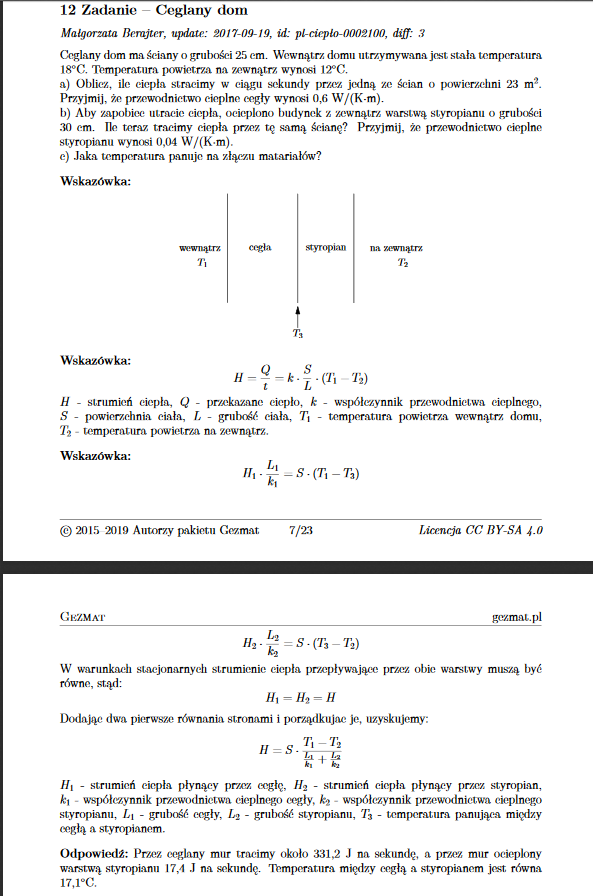

# Temat projektu - Intelligent office building

## Struktura systemu agentowego:
  - kalendarz centralny - będzie jednocześnie centralnym agentem podejmującym wszelkie decyzje
  #### Pozostali agenci koomunikujący się z centralnym:
  - klimatyzatory
  - źródła energii
  - ludzie
  - termometry w pomieszczeniach i na zewnątrz
  - prognoza pogody (np. agent pobierający temperaturę w danym dniu o danej godzinie z publicznego api)
  - informacje o korkach na drogach (j.w.)
## Opis części fizycznej projektu (termodynamika):
  - obliczanie potrzebnej energii klimatyzatora w oparciu o bilans cieplny [(przykład)](#przykładowe-zadanie)    
  - zakładamy, że temperatura w całym pokoju jest taka sama
  - na temperaturę w pokoju składają się:
      + wymiana ciepła przez każdą ze ścian pokoju (zarówno z innymi pokojami - ściany boczne oraz sufit i podłoga, jak i otoczeniem zewnętrznym)
      + ciepło (w sensie fizycznym) klimatyzatora
  - bierzemy pod uwagę izolację jaką są ściany
  - analiza sprawności klimatyzatora - czyli czy charakterystyka poboru energi jest liniowa w zależnośći od mocy chłodzenia/grzania, czy nie. Jeśli tak to zostanie to uwzględnione w algorytmie.
## Algorytm:
  - dane wejściowe:
      + data i długość spotkania
      + żądana temperatura na spotkaniu
      + informacje o lokalizacji organizatora spotkania (potencjalna informacja o spóźnieniu)
      + moc klimatyzatora (czy zdążymy uzyskać daną temperaturę)
      + efektywność klimatyzatora
      + prognozowana temperatura w czasie spotkania na zewnątrz i w pomieszczeniach sąsiednich
      + źródła energii
  - cel - minimalizacja zużytej energii
  - algorytm (propozycje do eksperymentowania):
    + zachłanny - zawsze bierzemy pokój, który według symulacji będzie miał najbardziej zbliżoną temperaturą w czasie spotkania jak najmniejszym kosztem, spośród wolnych pokojów
    + jeśli nie będzie za dużo danych, może uda się zastosować backtracking
  - informacje ze źródeł energi będą kolejną zmienną wpływającą na ewentualne czasy grzania i chłodzenia np. czekamy ze schłodzeniem pokoju, aż będzie dużo słońca, żeby energia szła z paneli słonecznych, a nie z sieci
  - zakładamy minimalną oraz maksymalną temperaturę w pomieszczeniach utrzymywaną przez całą dobę żeby nie uległy zniszczeniu rzeczy znajdujące się w biurach. Decyzja jaka temperatura faktycznie będzie utrzymywana podejmowana dynamicznie

## Przykładowe zadanie
