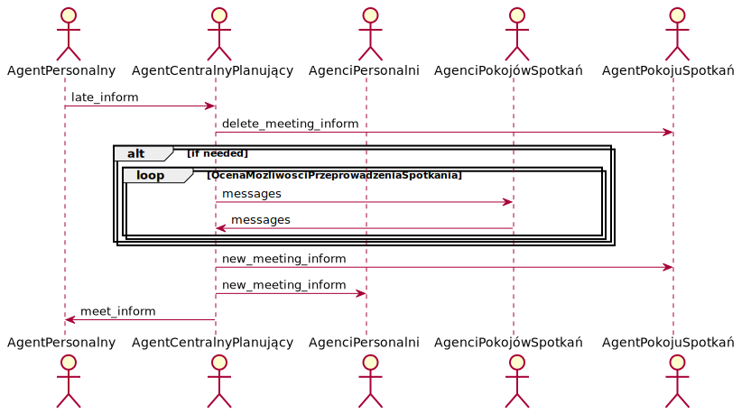
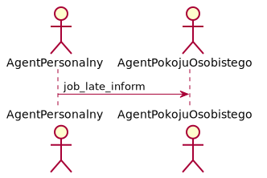
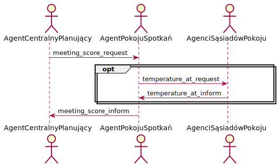

# Raport 3

## Cel projektu:

Projekt ma na celu stworzenie systemu zarządzającego budynkiem, umawianie spotkań oraz minimalizację zużycia energii przeznaczonej na ogrzewanie pomieszczeń.

## Agenci

#### Agent personalny

 - Rola: Agent personalny
 - Opis: Agent reprezentujący pracownika. Odpowiadający za umawianie spotkań. Informujący o ewentualnych spóźnieniach. Przechowuje kalendarz użytkownika.
 - Protokoły i Aktywności: UmawianieSpotkania, InformowanieOSpóźnieniuNaSpotkanie, PreferencjePracownika, InformowanieODacieIGodzinie, InformowanieOSpóźnieniuDoBiura
 - Uprawnienia: Odczyt i modyfikacje osobistego kalendarza
 - Zadania:
	  + Cykl życia:
	    + EGZYSTENCJA = PreferencjePracownika.(UmawianieSpotkań | InformowanieODacieIGodzinie | InformowanieOSpóźnieniuDoBiura)ω
	    + UmawianieSpotkań = (UmawianieSpotkania)|InformowanieOSpóźnieniuNaSpotkanie
	
#### Agent pokoju spotkań

 - Rola: Agent pokoju spotkań
 - Opis: Agent reprezentujący pokój spotkań. Odpowiadający za umawianie spotkań. Kontroluje swoją temperaturę. Przechowuje własny kalendarz
 - Protokoły i Aktywności: UmawianieSpotkania, WymianaTemperaturyMiędzyPokojami, ZapytanieOTemperaturęNaZewnątrz, InformowanieOZużytejEnergii, InformowanieODacieIGodzinie, OcenaMożliwościPrzeprowadzeniaSpotkania
 - Uprawnienia: Odczyt i modyfikacje kalendarza pokoju. Dostęp do termometru i klimatyzacji.
 - Zadania:
     + Cykl życia:
       EGZYSTENCJA = (UmawianieSpotkania | WymianaTemperaturyMiędzyPokojami | ZapytanieOTemperaturęNaZewnątrz | InformowanieOZużytejEnergii | InformowanieODacieIGodzinie | OcenaMożliwościPrzeprowadzeniaSpotkania) ω

#### Agent pokoju osobistego

 - Rola: Agent pokoju osobistego
 - Opis: Agent reprezentujący pokój osobisty. Przechowuje własny kalendarz.
 - Protokoły i Aktywności: WymianaTemperaturyMiędzyPokojami, ZapytanieOTemperaturęNaZewnątrz, PreferencjePracownika, InformowanieOZużytejEnergii, InformowanieODacieIGodzinie, OcenaMożliwościPrzeprowadzeniaSpotkania, InformowanieOSpóźnieniuDoBiura
 - Uprawnienia: Odczyt i modyfikacje kalendarza pokoju. Dostęp do termometru i klimatyzacji.
 - Zadania:
     + Cykl życia:
       EGZYSTENCJA = PreferencjePracownika.(WymianaTemperaturyMiędzyPokojami | ZapytanieOTemperaturęNaZewnątrz | InformowanieOZużytejEnergii | InformowanieODacieIGodzinie | OcenaMożliwościPrzeprowadzeniaSpotkania | InformowanieOSpóźnieniuDoBiura) ω

#### Agent centralny planujący

 - Rola: Agent centralny planujący
 - Opis: Agent przydzielający pokoje do spotkań. Przechowuje kalendarze pokojów spotkań.
 - Protokoły i Aktywności: UmawianieSpotkania, InformowanieOSpóźnieniuNaSpotkanie, InformowanieODacieIGodzinie, OcenaMożliwościPrzeprowadzeniaSpotkania
 - Uprawnienia: Odczyt i modyfikacje kalendarza.
 - Zadania:
     + Cykl życia:
       EGZYSTENCJA = (UmawianieSpotkania | InformowanieOSpóźnieniuNaSpotkanie | InformowanieODacieIGodzinie | OcenaMożliwościPrzeprowadzeniaSpotkania) ω

#### Agent techniczny

 - Rola: Agent techniczny
 - Opis: Agent zbierający informacje o ilości zużytej energii.
 - Protokoły i Aktywności: InformowanieOZużytejEnergii
 - Uprawnienia: Brak.
 - Zadania:
     + Cykl życia:
       EGZYSTENCJA = (InformowanieOZużytejEnergii) ω

#### Agent "zegarek"

 - Rola: Agent "zegarek"
 - Opis: Agent synchronizujący czas. Potrzebny do symulowania przyspieszonego czasu.
 - Protokoły i Aktywności: InformowanieODacieIGodzinie
 - Uprawnienia: Brak.
 - Zadania:
     + Cykl życia:
       EGZYSTENCJA = (InformowanieODacieIGodzinie)ω

#### Agent zewnętrzny

- Rola: Agent zewnętrzny
 - Opis: Agent informujący o temperaturze na zewnątrz.
 - Protokoły i Aktywności: ZapytanieOTemperaturęNaZewnątrz
 - Uprawnienia: Brak.
 - Zadania:
     + Cykl życia:
       EGZYSTENCJA = (ZapytanieOTemperaturęNaZewnątrz)ω

## Protkoły
 - UmawianieSpotkania,
 - WymianaTemperaturyMiędzyPokojami,
 - InformowanieOSpóźnieniuNaSpotkanie, 
 - InformowanieOSpóźnieniuDoBiura, 
 - InformowanieODacieIGodzinie,
 - InformowanieOZużytejEnergii, 
 - PreferencjePracownika, 
 - ZapytanieOTemperaturęNaZewnątrz,
 - OcenaMożliwościPrzeprowadzeniaSpotkania

#### UmawianieSpotkania
##### Diagram


##### Przykładowe wiadomości
```Python
meet_request = {
    "meeting_guid": "AWDH5435-89oij-JIKI",
    "start_date": "23-01-2020 12:23",
    "end_date":"23-01-2020 14:23",
    "temperature": 30
    "participants": ["aaa@lll", "bbb@lll"]
}
```

```Python
new_meeting_inform = {
    "meeting_guid": "AWDH5435-89oij-JIKI",
    "start_date": "23-01-2020 12:23",
    "end_date":"23-01-2020 14:23",
    "temperature": 30,
    "room_id": 21,
    "organizer_jid": "aaa@lll"
}
```

```Python
meet_inform = {
    "meeting_guid": "AWDH5435-89oij-JIKI",
    "start_date": "23-01-2020 12:23",
    "end_date":"23-01-2020 14:23",
    "room_id": 21,
    "temperature": 30
}
```

```Python
meet_refuse = {
    "meeting_guid": "AWDH5435-89oij-JIKI",
    "start_date": "23-01-2020 12:23",
    "end_date":"23-01-2020 14:23",
    "room_id": 21,
    "temperature": 30
}
```

#### WymianaTemperaturyMiędzyPokojami
##### Diagram


##### Przykładowe wiadomości
```Python
room_data_exchange_request = {
    "temperature": 20,
}
```

```Python
room_data_inform = {
    "temperature": 20,
}
```


#### InformowanieOSpóźnieniuNaSpotkanie
##### Diagram


##### Przykładowe wiadomości
```Python
late_inform = {
    "arrival_datetime": "16-04-2020 11:00",
    "meeting_guid": "AWDH5435-89oij-JIKI",
    "force_move": False
}
```

```Python
new_meeting_inform = {
    "meeting_guid": "AWDH5435-89oij-JIKI",
    "start_date": "23-01-2020 12:23",
    "end_date":"23-01-2020 14:23",
    "temperature": 30,
    "room_id": 21,
    "organizer_jid": "aaa@lll"
}
```

```Python
meet_inform = {
    "meeting_guid": "AWDH5435-89oij-JIKI",
    "start_date": "23-01-2020 12:23",
    "end_date":"23-01-2020 14:23",
    "room_id": 21,
    "temperature": 30
}
```
#### InformowanieOSpóźnieniuDoBiura
##### Diagram


##### Przykładowe wiadomości
```Python
job_late_inform = {
    "arrival_datetime": "16-04-2020 11:00"
}
```

#### InformowanieODacieIGodzinie
##### Diagram


##### Przykładowe wiadomości
```Python
datetime_inform = {
    "datetime": "16-04-2020 11:15"
}
```

#### InformowanieOZużytejEnergii
##### Diagram


##### Przykładowe wiadomości
```Python
energy_usage_inform = {
    "energy_used_since_last_message": 20
}
```

#### PreferencjePracownika
##### Diagram


##### Przykładowe wiadomości
```Python
preferences_inform = {
    "optimal_temperature": 20
}
```

#### ZapytanieOTemperaturęNaZewnątrz
##### Diagram


##### Przykładowe wiadomości
```Python
outdoor_temperature_request = {
    "date": "23-01-2020 12:23"
}
```

```Python
outdoor_temperature_inform = {
    "temperature": 14
}
```

#### Ocena możliwości przeprowadzenia spotkania
##### Diagram


##### Przykładowe wiadomości
```Python
meeting_score_request = {
    "meeting_guid": "AWDH5435-89oij-JIKI",
    "start_date": "23-01-2020 12:23",
    "end_date":"23-01-2020 14:23",
    "temperature":20
}
```

```Python
temperature_at_request = {
    "request_guid": "AWDH5435-89oij-JIKI",
    "date": "23-01-2020 14:23"
}
```

```Python
temperature_at_inform = {
    "request_guid": "AWDH5435-89oij-JIKI",
    "temperature": 20
}
```

```Python
meeting_score_inform = {
    "meeting_guid": "AWDH5435-89oij-JIKI",
    "score": 55
}
```
## Scenariusze

 #### Spóźnienie agenta personalnego (na spotkanie)

 Scenariusz ma na celu pokazanie poprawnego działania przesuwania istniejącego już spotkania z powodu spóźnienia organizatora. W scenariuszu tworzony jest agent personalny, cztery pokoje spotkań oraz agent centralny. Agent personalny tworzy nowe spotkanie, a po pewnym czasie informuje o spóźnieniu. Gdy informuje o spóźnieniu za pierwszym razem wymusza zmianę spotkania na nowe, które rozpocznie się o na nowo określonej godzinie i będzie trwało tyle samo czasu ile stare spotkanie. Za drugim razem nie ma wymuszenia, zatem godzina rozpoczęcia spotkania spotkania ulega zmianie, ale godzina zakończenia już nie. W obu przypadkach agenci pokojów spotkań oraz agent personalny otrzymują wiadomość od agenta centralnego jak o nowym spotkaniu.

 #### Umawianie nowych spotkań

 Scenariusz ma na celu pokazanie poprawnego działania umieszczania spotkań w różnych pokojach z myślą o zaoszczędzeniu energii. W scenariuszu tworzeni są czterej agenci pokojów spotkań, dwaj agenci personalni oraz agent centralny. Jeden z agentów personalnych tworzy nowe spotkanie. Następnie wysyła zapytanie do centralnego o nowe spotkanie. Centralny odpytuje wszystkie pokoje spotkań o ich ocenę kosztu danego spotkania. W tym przypadku każdy pokój ma tę samą ocenę, więc wybrany zostaje pierwszy. Następnie drugi agent personalny tworzy kolejne spotkanie w tym samym czasie. Centralny odpytuje wszystkie pokoje i ustawia spotkanie w pokoju sąsiednim z tym pierwszym (pierwszy zwraca koszt jako None, ponieważ jest zajęty w tym czasie). Następnie kolejne spotkanie jest umawiane zaraz po wcześniejszych spotkaniach. Centralny po odpytaniu wszystkich pokoi wybiera pokój w którym się odbywało pierwsze spotkanie, jako pokój z najmniejszym kosztem.

 #### Spóźnianie agenta personalnego (do biura)

 Scenariusz ma na celu pokazanie opóźniania ogrzewania pokoju osobistego w przypadku spóźniania się jego użytkowników. Tworzeni są agenci personalni oraz agenci ich pokojów osobistych. Agenci personalni informują o spóźnieniu do biura. W "dobrym" scenariuszu ogrzewanie pokoju jest wtedy włączanie z odpowiednim opóźnieniem. "Zły" scenariusz nie reaguje na spóźnienie pracownika i zawsze uruchamia ogrzewanie o tej samej porze.

## Stan prac

Kończymy implementację podstawowych scenariuszy wymienionych wyżej (i działają). Planujemy jeszcze stworzyć kompleksowy scenariusz przedstawiający jednocześnie wszystkie aspekty systemu. W naszych planach te zadania będą etapami kończącymi projekt.
